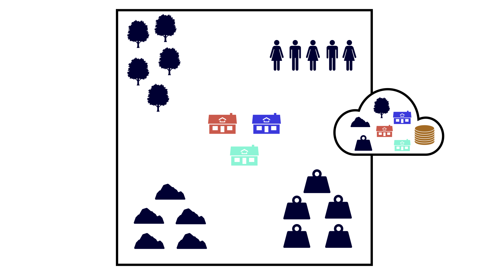
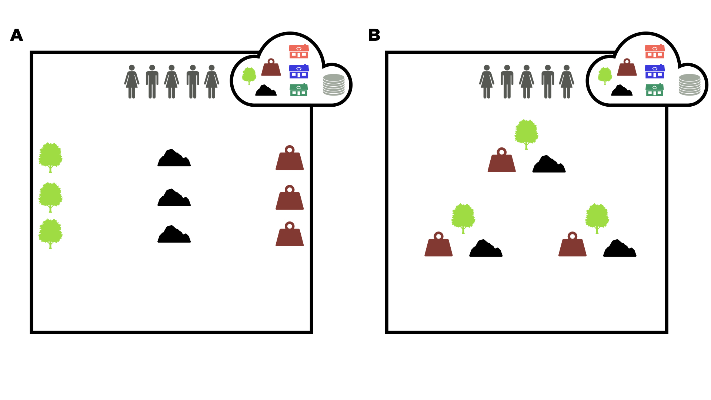

# Modified AI-Economist

## Project 1: A Multi-agent Reinforcement Learning Study of Libertarian and Utilitarian Governing Systems

- [The Paper](https://drive.google.com/file/d/1Wob_XwMJ7cINA0jjFU1ylIo5w3o57thH/view?usp=share_link)
- [The Results](https://github.com/aslansd/modified-ai-economist/tree/main/tutorials/Results%20(Project%201))
- [The Notebook for the Full-Libertarian Governing System](https://github.com/aslansd/modified-ai-economist/blob/main/tutorials/a_multi-agent_reinforcement_learning_study_of_libertarian_and_utilitarian_governing_systems_RLlib_FullLibertarian.ipynb)
- [The Notebook for the Semi-Libertarian/Utilitarian Governing System](https://github.com/aslansd/modified-ai-economist/blob/main/tutorials/a_multi-agent_reinforcement_learning_study_of_libertarian_and_utilitarian_governing_systems_RLlib_SemiLibertarianUtilitarian.ipynb)
- [The Notebook for the Full-Utilitarian Governing System](https://github.com/aslansd/modified-ai-economist/blob/main/tutorials/a_multi-agent_reinforcement_learning_study_of_libertarian_and_utilitarian_governing_systems_RLlib_FullUtilitarian.ipynb)
- [The Notebook for Generating the Plots of the Paper](https://github.com/aslansd/modified-ai-economist/blob/main/tutorials/a_multi-agent_reinforcement_learning_study_of_libertarian_and_utilitarian_governing_systems_Plotting.ipynb)

### Abstract
It is generally believed that humans’ behaviors co-evolve with their governing systems. Governing systems or institutions could be mapped across the procedural-consequentialist axis from Full-Libertarian to Semi-Libertarian/Utilitarian, and from the latter to Full-Utilitarian systems, or across its discriminative nature from Inclusive to Arbitrary, and from the latter to Extractive institutions. In this study, by extending the AI-Economist - a recently developed two-level multi-agent reinforcement learning environment, by voting mechanism, first, it is shown that across the procedural-consequentialist axis, the Full-Libertarian governing system generates more inequity averse individuals. Additionally, it is shown that while under the Full-Libertarian governing system the Equality is lower, the Productivity and Maximin are higher. Finally, it is shown that resource sustainability is higher under the Full-Libertarian governing system. Afterward, by slightly modifying the voting mechanism, the Semi-Libertarian/Utilitarian governing system is divided to three governing institutions across its discriminative axis: Inclusive, Arbitrary, and Extractive. Then, it is shown that agents under the Arbitrary and Extractive institutions are less inequity averse compared to agents under an Inclusive institution. Furthermore, an Arbitrary institution is the least effective institution considering Productivity, Equality, and Maximin in the society. Moreover, while the resource sustainability is not significantly different across three governing institutions, by introducing a measure to calculate the fairness of an institution, it is shown that the Arbitrary and Extractive institutions are the most unfair systems. Overall, this
paper adds to the growing literature of the application of multi-agent reinforcement learning in investigation of behavioral and economical phenomena.

<p align="center">
  
</p>

## Project 2: A Multi-agent Reinforcement Learning Study of Emergence of Social Classes out of Arbitrary Governance: The Role of Environment

- [The Paper](https://drive.google.com/file/d/1va5gMq39Of3mky0ZJa7jyW6ymrOXMRjD/view?usp=share_link)
- [The Results](https://github.com/aslansd/modified-ai-economist/tree/main/tutorials/Results%20(Project%202))
- [The Notebook for the Band-like Environment](https://github.com/aslansd/modified-ai-economist/blob/main/tutorials/a_multi-agent_reinforcement_learning_study_of_emergence_of_social_classes_out_of_arbitrary_governance_the_role_of_environment_RLlib_Band.ipynb)
- [The Notebook for the Uniform Environment](https://github.com/aslansd/modified-ai-economist/blob/main/tutorials/a_multi-agent_reinforcement_learning_study_of_emergence_of_social_classes_out_of_arbitrary_governance_the_role_of_environment_RLlib_Uniform.ipynb)
- [The Notebook for Generating the Plots of the Paper](https://github.com/aslansd/modified-ai-economist/blob/main/tutorials/a_multi-agent_reinforcement_learning_study_of_emergence_of_social_classes_out_of_arbitrary_governance_the%20role_of_environment_Plotting.ipynb)

### Abstract
There are several theories in economics regarding the roots or causes of prosperity in a society. One of these theories or hypotheses - named geography hypothesis - mentions that the reason why some countries are prosperous and some others are poor is the geographical location of the countries in the world as makes their climate and environment favorable or unfavorable regarding natural resources. Another competing hypothesis states that man-made institutions particularly inclusive political institutions are the reasons why some countries are prosperous and some others are in poverty. On the other hand, there is a specific political theory developed for the long-term social development in Iran - named Arbitrary Rule and Aridisolatic Society which particularly emphasizes on the role of aridity to shape arbitrary political and economical institutions in Iran without any functional social classes in the society. In this paper, by extending the AI-Economist - a recently developed two-level multi-agent reinforcement learning environment, I show that when the central planner ruling the environment by arbitrary rules, the society evolves through different paths in different environments. In the environment having band-like vertical isolated patches of natural resources, all mobile agents are equally exploited by the central planner and the central planner is also not gaining any income, while in the society having more uniformly distributed natural resources, the productivity and Maximin are higher and the society generates a heterogeneous stratified social structure. All these findings provide a partial answer to the above debate and reconcile the role of geography and political institutions on the long-term development in a region.

<p align="center">
  
</p>

## Installation Instructions

This package was installed and tested in Windows 10 Pro. To install this package from the source, you'll need to have Python 3.7 installed:

1. Clone this repository to your local machine:

 ```
   git clone www.github.com/aslansd/modified-ai-economist
 ```

2. Create a new conda environment (named "modified-ai-economist" below - replace with anything else) and activate it:

```pyfunctiontypecomment
   conda create --name modified-ai-economist python=3.7 --yes
   conda activate modified-ai-economist
```

3. Install as an editable Python package

```pyfunctiontypecomment
   cd modified-ai-economist
   pip install -e .
```

## Testing your Install

To test your installation, try running:

```
conda activate modified-ai-economist
python -c "import modified_ai_economist"
```